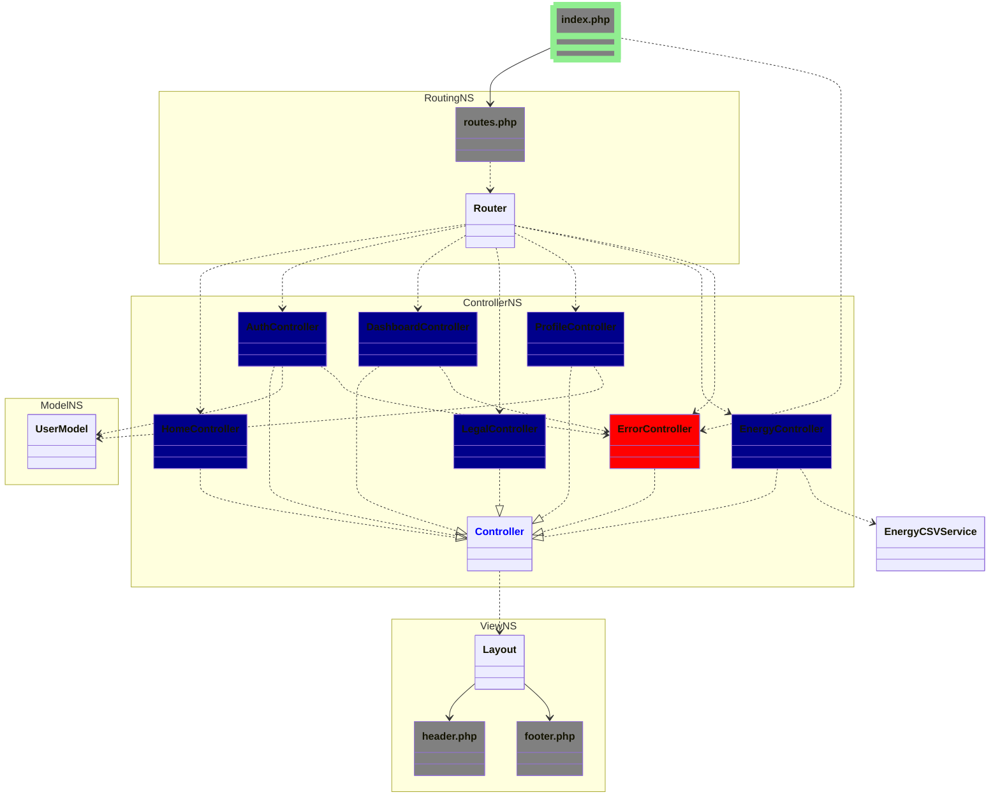

# Diagrame de classe global

```mermaid

classDiagram
    class Index["index.php"]
    style Index fill:grey,stroke:lightgreen,stroke-width:10px
    
    
    namespace RoutingNS {
        class routes["routes.php"]
        class Router
    }
    style routes fill:grey


    namespace ModelNS {
        class UserModel
    }


    namespace ViewNS {
        class Layout
        class header["header.php"]
        class footer["footer.php"]
    }
    style header fill:grey
    style footer fill:grey

    
    namespace ControllerNS {
        class Home["HomeController"]
        class Profile["ProfileController"]
        class Auth["AuthController"]
        class Dashboard["DashboardController"]
        class Legal["LegalController"]
        class Energy["EnergyController"]
        class Error["ErrorController"]
        class Controller
    }
    style Home fill:darkblue
    style Auth fill:darkblue
    style Dashboard fill:darkblue
    style Legal fill:darkblue
    style Profile fill:darkblue
    style Energy fill:darkblue
    style Error fill:red
    style Controller color:blue


    class EnergyCSV["EnergyCSVService"]


    Index --> routes
    Index ..> Error
    
    routes ..> Router
    Router ..> Home
    Router ..> Auth
    Router ..> Dashboard
    Router ..> Legal
    Router ..> Profile
    Router ..> Energy
    Router ..> Error
    
    Home ..|> Controller
    Auth ..|> Controller
    Dashboard ..|> Controller
    Legal ..|> Controller
    Profile ..|> Controller
    Energy ..|> Controller
    Error ..|> Controller
    
    Controller ..> Layout
    Layout --> header
    Layout --> footer
    
    Auth ..> UserModel
    Auth ..> Error
    
    Dashboard ..> Error
    
    Profile ..> UserModel
    
    Energy ..> EnergyCSV
```